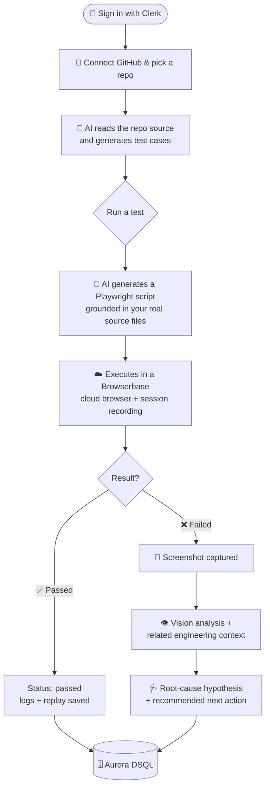
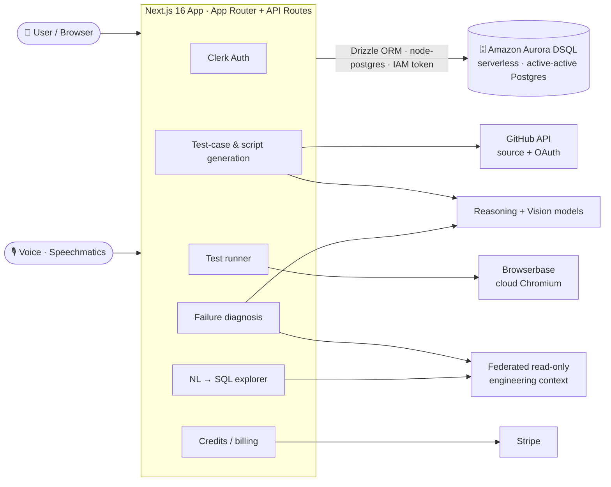
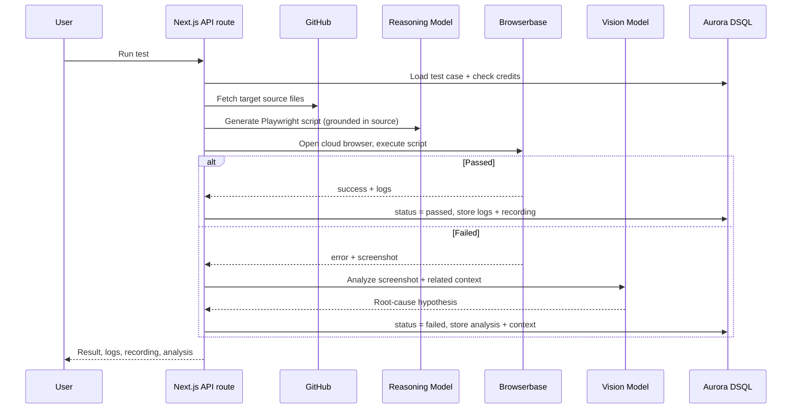

<div align="center">

# ⚡ scriptless.ai

### Describe what to test. Watch it test itself.

**AI-native, scriptless browser test automation for your GitHub repositories.**
Connect a repo → AI reads your code → it writes the test cases → it writes the Playwright script → it runs in a real cloud browser → and when something breaks, it tells you *why*.

<br/>

[](https://scriptless-ai-eta.vercel.app/)
&nbsp;
[](https://nextjs.org)
[](https://aws.amazon.com/rds/aurora/dsql/)
[](https://playwright.dev)

<br/>

**[🚀 Try it live](https://scriptless-ai-eta.vercel.app/)** · **[✨ Features](#-what-you-can-do)** · **[🧭 How it works](#-how-it-works-the-full-flow)** · **[🏗 Architecture](#-architecture)** · **[🛠 Setup](#-getting-started)**

</div>

---

## 📖 Table of Contents

- [The Pitch](#-the-pitch)
- [Why It's Different](#-why-its-different)
- [What You Can Do](#-what-you-can-do)
- [How It Works — The Full Flow](#-how-it-works-the-full-flow)
- [Architecture](#-architecture)
- [The Data Layer: Aurora DSQL](#-the-data-layer-aurora-dsql)
- [Tech Stack](#-tech-stack)
- [Getting Started](#-getting-started)
- [Environment Variables](#-environment-variables)
- [Project Structure](#-project-structure)
- [FAQ](#-faq)

---

## 🎯 The Pitch

Writing end-to-end browser tests is the chore nobody wants. You context-switch out of building, hand-write brittle selectors, babysit flaky runs, and then re-write half of it the moment the UI changes. Most teams just… don't. Coverage rots.

**scriptless.ai removes the writing entirely.**

You point it at a GitHub repository. It reads the actual source — your routes, components, forms, and inputs — and reasons about what a real user would do. From that understanding it generates a suite of meaningful test cases, turns each one into an executable **Playwright** script, and runs it inside a **real, isolated cloud browser**. There is no test file to author, no selector to maintain, no CI YAML to wrestle.

And when a test fails, it doesn't just hand you a red ✗. It captures the failure screenshot, runs **vision analysis** to explain what went wrong on screen, pulls **related engineering context** (recent commits, open issues, error reports) that might explain the regression, and surfaces a plain-English root-cause hypothesis with a recommended next action.

> **In one line:** scriptless.ai is an autonomous QA engineer that reads your repo, writes the tests, runs them in the cloud, and investigates its own failures.

---

## 💡 Why It's Different

<table>
<tr>
<td width="50%" valign="top">

#### 🧠 It understands your code, not just your URL
Test cases are grounded in your **actual source files** pulled from GitHub — exact component text, input names, labels, and routes — so the generated steps and selectors map to reality instead of guesses.

</td>
<td width="50%" valign="top">

#### 🪄 Zero scripts, truly scriptless
The AI emits a self-contained Playwright body with resilient locators, auto-retries, and lenient assertions. You never open a `.spec.ts`. Regenerate any test on demand when your UI shifts.

</td>
</tr>
<tr>
<td width="50%" valign="top">

#### ☁️ Runs in real cloud browsers
Every run executes in a fresh, isolated **Browserbase** Chromium session with a full session recording — not a mocked DOM, not a headless shim on your laptop.

</td>
<td width="50%" valign="top">

#### 🔍 Failures that explain themselves
Screenshot + **vision analysis** + cross-system context → a real root-cause hypothesis ("this looks like a regression from a recent commit"), not a stack trace dump.

</td>
</tr>
<tr>
<td width="50%" valign="top">

#### 🎙 Drive it with your voice
Speak your intent — *"run the failing tests"*, *"show me recent errors for checkout"* — and the same pipelines fire as if you'd clicked.

</td>
<td width="50%" valign="top">

#### 🌐 Built on a serverless, distributed DB
The entire platform runs on **Amazon Aurora DSQL** — active-active, serverless Postgres with IAM-token auth and no connection string to leak.

</td>
</tr>
</table>

---

## ✨ What You Can Do

| Capability | What it gives you |
|---|---|
| 🔗 **Connect a GitHub repo** | OAuth in, pick any repository, and scriptless reads its source tree as test context. |
| 🤖 **AI test-case generation** | Get a prioritized suite of realistic test cases (title, description, type, priority, target route + files) in seconds. |
| 🎬 **Scriptless execution** | Each test is compiled to a Playwright script and run in a real cloud browser — with a full replayable session recording. |
| 🩺 **Smart failure analysis** | Vision-based screenshot diagnosis + related context → a root-cause hypothesis and a recommended fix path. |
| 🔭 **Agent Trace** | Every query the system runs on your behalf is logged — fully transparent, no black box. |
| ⚡ **Smart Run** | Prioritize the tests most likely impacted by your *recent* commits, so you run what matters first. |
| 🗣 **Natural-language data explorer** | Ask questions about your engineering data in plain English; the system grounds and generates safe, read-only SQL and shows you the results. |
| 🎙 **Voice commands** | Run tests, filter results, and ask data questions hands-free. |
| 💳 **Credits & billing** | Usage-metered credits with Stripe checkout built in. |

---

## 🧭 How It Works — The Full Flow

Here's exactly what *you* do and what *you can expect* at each step.



<br/>

<details open>
<summary><b>① Sign in &amp; connect a repository</b></summary>

You authenticate with **Clerk**, then connect **GitHub** via OAuth and select a repository.
**Expect:** your repos listed in the workspace, each one ready to expand into a test suite. New accounts start with credits to spend on generation and runs.

</details>

<details>
<summary><b>② Generate test cases with AI</b></summary>

scriptless walks the repository tree, picks the meaningful source files (routes, components, `lib/`, `api/`…), and feeds them to a reasoning model.
**Expect:** a generated suite of test cases — each with a title, description, type, priority, target route, and the source files it's grounded in. *(Costs credits; deducted automatically.)*

</details>

<details>
<summary><b>③ Run a test (the scriptless part)</b></summary>

Hit **Run**. The system fetches the relevant source files for that test, then prompts the model to write a complete **Playwright** script — with resilient locators, auto-retry helpers, sensible waits, and lenient assertions — and executes it in a fresh **Browserbase** Chromium session.
**Expect:** a live execution modal with streaming logs, a terminal output tab, the generated script, and a **session recording** you can replay frame-by-frame.

</details>

<details>
<summary><b>④ When it passes</b></summary>

**Expect:** status flips to `passed`, logs + session URL are stored, and credits are settled. Done.

</details>

<details>
<summary><b>⑤ When it fails — the investigation</b></summary>

A failure kicks off the diagnosis pipeline automatically:
- 📸 **Screenshot** of the page at the moment of failure.
- 👁 **Vision analysis** describes what's on screen and the most likely root cause.
- 🔭 **Related context** surfaces recent commits, open issues, and error reports that could explain the break.
- 🩺 A concise **root-cause hypothesis** tells you whether to fix the test, fix the app, or wait on an upstream fix.

**Expect:** tabs for *Failure Analysis*, *Related Context*, *Agent Trace*, *Terminal Output*, and the *Playwright Script* — everything you need to act, in one modal.

</details>

<details>
<summary><b>⑥ Work faster: Smart Run, the Explorer, and voice</b></summary>

- **Smart Run** ranks tests by overlap with your most recent commits — run the highest-risk tests first.
- **Explorer** turns plain-English questions into safe, read-only SQL over your connected engineering data and renders the results.
- **Voice** drives all of the above hands-free through the same pipelines.

</details>

---

## 🏗 Architecture

scriptless.ai is a single **Next.js 16** application (App Router, server routes) that orchestrates a set of specialized cloud services, with **Amazon Aurora DSQL** as the system of record.



> **A note on diagrams:** the system above is the source of truth. The repo also ships a UI **sitemap** reference (`architecture.png`) showing how screens connect; treat it as a navigational map of the front end, while the diagram here describes the runtime architecture and the data layer.

<details>
<summary><b>Request lifecycle of a single test run</b></summary>



</details>

---

## 🗄 The Data Layer: Aurora DSQL

The platform's database runs on **Amazon Aurora DSQL** — AWS's **serverless, distributed, active-active** SQL database. We migrated the entire datastore from a traditional serverless Postgres (Neon HTTP driver) to DSQL. This was a deliberate, non-trivial transition, and it's one of the more interesting parts of the build.

### Why move to Aurora DSQL?

- **Serverless & distributed by design** — active-active, multi-writer scaling with no instances to size or fail over.
- **No static database password** — connections authenticate with a **short-lived IAM token**, so there's no long-lived secret to leak or rotate.
- **Operational simplicity at the edge** — a great fit for serverless Next.js functions on Vercel, where every invocation is short-lived.

### What the transition required (and why)

Aurora DSQL is PostgreSQL **wire-compatible** but intentionally drops features to enable distributed scaling. Adapting the app meant several concrete changes:

| What changed | Why DSQL requires it | How we handled it |
|---|---|---|
| **`SERIAL` → integer identity** | DSQL has no `SERIAL` pseudo-type | Every PK is now `integer … generatedAlwaysAsIdentity({ cache: 65536 })` (the mandatory `CACHE` clause is carried in the Drizzle schema) |
| **Foreign keys removed** | DSQL doesn't enforce FK constraints | Referential integrity is enforced in **application code** before writes |
| **`ON DELETE CASCADE` removed** | Cascades aren't supported | Dependent rows are cleaned up explicitly in app logic |
| **HTTP driver → wire protocol** | The Neon HTTP serverless driver is incompatible | Switched to **`node-postgres` (`pg`)** over the real Postgres wire protocol |
| **IAM-token auth** | No static password; tokens are short-lived | `AuroraDSQLPool` mints/refreshes an IAM token **per new connection** automatically — no manual token handling |
| **Optimistic concurrency (OCC)** | DSQL uses Repeatable-Read isolation + OCC; write/write conflicts abort one side | Conflict-prone flows (get-or-create, upserts) are wrapped in an **OCC retry** with backoff |
| **Async, one-statement-per-tx DDL** | DSQL applies DDL asynchronously and forbids mixing DDL + DML | Schema is applied as a **single fresh baseline**, statement-by-statement, instead of replaying migration history |

The connection layer (`db/index.ts`) is a cached `AuroraDSQLPool` with TLS required, small pool size for serverless, and connection recycling before DSQL's 1-hour connection cap. The query surface — Drizzle's `db.select()/insert()/update()` — is **unchanged**, so the migration touched the connection, schema, and a couple of concurrency-sensitive routes, not the hundreds of call sites.

> 📄 The complete migration plan — constraints, PK strategy, provisioning, data runbook, and rollback — lives in [`MIGRATION.md`](MIGRATION.md).

---

## 🧩 Tech Stack

| Layer | Technology |
|---|---|
| **Framework** | Next.js 16 (App Router) · React 19 · TypeScript |
| **Styling** | Tailwind CSS v4 · Radix UI · Framer Motion |
| **Database** | Amazon Aurora DSQL · Drizzle ORM · node-postgres |
| **Auth** | Clerk |
| **Source / VCS** | GitHub OAuth + REST API |
| **Reasoning & NL→SQL** | Reasoning model (test generation) · Gemini (script + SQL generation) |
| **Vision** | Vision model for failure-screenshot analysis |
| **Browser automation** | Browserbase (cloud Chromium) · Playwright |
| **Voice** | Speechmatics real-time |
| **Billing** | Stripe |

---

## 🚀 Getting Started

### Prerequisites

- **Node.js 20+**
- An **AWS account** with an Aurora DSQL cluster
- Accounts / API keys for: **Clerk**, **GitHub OAuth app**, **Browserbase**, **Stripe**, **Speechmatics**, and your model providers (**Gemini** + reasoning/vision)

### 1. Clone & install

```bash
git clone <your-repo-url>
cd scriptless.ai
npm install
```

### 2. Configure environment

Create a `.env` file in the project root and fill in the values from the [Environment Variables](#-environment-variables) section below.

### 3. Provision the database schema

The schema is applied **directly** to your DSQL cluster (DSQL doesn't replay standard migration history — see [the DSQL section](#-the-data-layer-aurora-dsql)).

```bash
# Apply the baseline schema to your DSQL cluster
node scripts/apply-dsql-ddl.mjs

# (optional) verify the connection + tables
node scripts/verify-dsql.mjs

# Inspect data with Drizzle Studio
npm run db:studio
```

### 4. Run the app

```bash
npm run dev
```

Open **[http://localhost:4000](http://localhost:4000)** 🎉

<details>
<summary><b>Available scripts</b></summary>

| Script | Description |
|---|---|
| `npm run dev` | Start the dev server on port **4000** |
| `npm run build` | Production build |
| `npm run start` | Start the production server |
| `npm run lint` | Run ESLint |
| `npm run db:generate` | Generate Drizzle SQL from the schema |
| `npm run db:push` | Push schema changes (review for DSQL compatibility first) |
| `npm run db:studio` | Open Drizzle Studio |

</details>

---

## 🔐 Environment Variables

<details open>
<summary><b>App</b></summary>

```env
NEXT_PUBLIC_APP_URL=http://localhost:4000
```

</details>

<details>
<summary><b>Database — Amazon Aurora DSQL</b></summary>

```env
DSQL_ENDPOINT=<clusterId>.dsql.<region>.on.aws
AWS_REGION=us-east-1

# Credentials: an attached IAM role is preferred. For local dev / static creds:
AWS_ACCESS_KEY_ID=...
AWS_SECRET_ACCESS_KEY=...
AWS_SESSION_TOKEN=...            # if using temporary credentials

# On Vercel with OIDC federation:
AWS_ROLE_ARN=arn:aws:iam::<account-id>:role/<role>

# Used ONLY by drizzle-kit tooling (db:generate / db:studio)
DATABASE_URL=postgresql://...
```

The runtime needs IAM permission to mint a DSQL connection token (`dsql:DbConnectAdmin`). See [`MIGRATION.md`](MIGRATION.md#53-iam-permissions).

</details>

<details>
<summary><b>Authentication — Clerk</b></summary>

```env
NEXT_PUBLIC_CLERK_PUBLISHABLE_KEY=pk_...
CLERK_SECRET_KEY=sk_...
NEXT_PUBLIC_CLERK_SIGN_IN_URL=/sign-in
NEXT_PUBLIC_CLERK_SIGN_UP_URL=/sign-up
```

</details>

<details>
<summary><b>GitHub OAuth</b></summary>

```env
GITHUB_CLIENT_ID=...
GITHUB_CLIENT_SECRET=...
GITHUB_REDIRECT_URI=http://localhost:4000/api/github/callback
```

</details>

<details>
<summary><b>AI models — generation, NL→SQL &amp; vision</b></summary>

```env
# Script generation + natural-language → SQL
GEMINI_API_KEY=...

# Reasoning model (test-case generation) + vision (failure analysis)
NVIDIA_API_KEY=...
NVIDIA_TEXT_MODEL=...                  # optional override
NVIDIA_VISION_MODEL=...                # optional override
NVIDIA_VISION_FALLBACK_MODELS=...      # optional, comma-separated
```

</details>

<details>
<summary><b>Browser automation — Browserbase</b></summary>

```env
BROWSERBASE_API_KEY=...
BROWSERBASE_PROJECT_ID=...
```

</details>

<details>
<summary><b>Voice — Speechmatics</b></summary>

```env
SPEECHMATICS_API_KEY=...
NEXT_PUBLIC_SPEECHMATICS_RT_URL=...    # optional real-time endpoint override
```

</details>

<details>
<summary><b>Billing — Stripe</b></summary>

```env
STRIPE_SECRET_KEY=sk_...
STRIPE_WEBHOOK_SECRET=whsec_...
NEXT_PUBLIC_STRIPE_PUBLISHABLE_KEY=pk_...
```

</details>

<details>
<summary><b>Federated engineering context (optional)</b></summary>

Powers *Related Context*, *Smart Run* signals, and the *Explorer*. The app degrades gracefully when it's not configured.

```env
CORAL_SIDECAR_URL=...
CORAL_SIDECAR_SECRET=...
```

</details>

---

## 📂 Project Structure

```
.
├── app/
│   ├── api/                    # Server routes (test gen, run, smart-run, explorer, billing…)
│   ├── workspace/              # Main authenticated app surface
│   ├── sign-in/ · sign-up/     # Clerk auth pages
│   └── page.tsx                # Landing page
├── db/
│   ├── index.ts                # Aurora DSQL connection (AuroraDSQLPool + Drizzle)
│   └── schema.ts               # Drizzle schema (DSQL-compatible identity PKs)
├── lib/
│   ├── inference/              # Test generation, script gen, vision analysis
│   ├── speechmatics/           # Voice client + command parser
│   └── db/                     # Integrity + OCC-retry helpers
├── scripts/
│   ├── apply-dsql-ddl.mjs      # Apply the DSQL baseline schema
│   └── verify-dsql.mjs         # Connectivity / schema check
├── MIGRATION.md                # Neon → Aurora DSQL migration plan
└── README.md
```

---

## ❓ FAQ

<details>
<summary><b>Do I ever write a test file?</b></summary>

No. You describe nothing manually — the AI generates both the test cases and the underlying Playwright scripts from your repository's source. You can regenerate any script on demand if your UI changes.

</details>

<details>
<summary><b>Where do tests actually run?</b></summary>

In real, isolated cloud Chromium sessions via Browserbase — each with a replayable session recording — not on your machine and not against a mocked DOM.

</details>

<details>
<summary><b>What happens when a test fails?</b></summary>

scriptless captures a screenshot, runs vision analysis to explain what's on screen, gathers related engineering context (recent commits, issues, errors), and produces a root-cause hypothesis with a recommended next action.

</details>

<details>
<summary><b>Why Aurora DSQL instead of plain Postgres?</b></summary>

For serverless, distributed, active-active scale with IAM-token auth (no static password). See [The Data Layer: Aurora DSQL](#-the-data-layer-aurora-dsql) and [`MIGRATION.md`](MIGRATION.md).

</details>

---

<div align="center">

**[🚀 Launch the live demo →](https://scriptless-ai-eta.vercel.app/)**

<sub>Built with Next.js 16, Aurora DSQL, Playwright & Browserbase.</sub>

</div>
