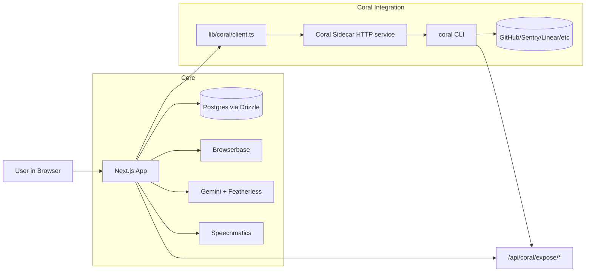
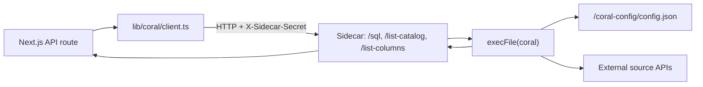
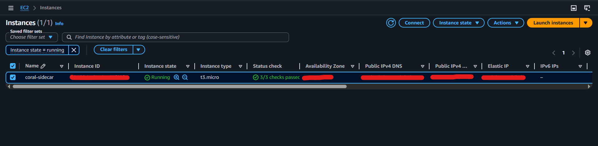

# Scriptless.ai + Coral

AI-first browser test automation for GitHub repos, now with Coral-powered federated context, explainable query traces, natural language SQL exploration, and smart test prioritization.

## What This Project Does

Scriptless helps teams:
- connect a GitHub repo
- generate test cases with AI
- execute tests in Browserbase cloud browsers
- diagnose failures with screenshot + vision analysis
- enrich failures with real cross-system context via Coral (GitHub, Sentry, Linear)

The recent updates make the system significantly more explainable and more useful for daily engineering workflows.

## Major Recent Updates

1. Related Context in failed test runs (Coral-enriched)
2. Agent Trace tab (every Coral query is logged)
3. Failure Analysis upgraded with contextual references
4. Coral Explorer (NL -> SQL -> Results)
5. Voice data queries (same result path as typed queries)
6. Smart Run (prioritize tests based on recent changes)

## Architecture

### Overall Application Architecture



### Why Sidecar Exists

Coral is executed as a CLI binary, not as an in-process npm library.

The sidecar is required because it provides:
- a stable runtime for the Coral binary and OS dependencies
- a secure HTTP bridge for Next.js server routes
- persistent Coral source configuration via mounted `/coral-config`
- operational isolation from web request handling

Without a sidecar (or equivalent long-running host), hosted Next.js alone cannot reliably run and persist Coral source state.

### Sidecar Request Flow



### Optional: Scriptless as a Coral Source (`/api/coral/expose/*`)

This endpoint family is **optional** and can be removed without breaking the core app.

What it does:
- Exposes Scriptless datasets (`test_cases`, `repositories`) as a Coral source.
- Lets Coral query Scriptless data and join it with external sources (GitHub, Linear, Sentry).

How it differs from the standard Coral routes:
- Standard routes: **App → Coral sidecar → external sources**
- Expose routes: **Coral → Scriptless app (via API key)**

If you do not need Coral to query Scriptless data, you can remove `/api/coral/expose/*` and the app will still work normally. But you still need your own sidecar implementation.

## Usage Scope (Individual or Single-Operator Organization)

This project currently targets **individual developers** or **single-operator organization setups**.

Why:
- Coral connects to data sources using **personal access tokens** (for example GitHub, Linear, Sentry).
- Those tokens are tied to a single user account and are provisioned manually.
- Coral is a compiled Rust CLI, so it must run in a **separate sidecar** process with a local config directory.
- The sidecar persists source configuration and secrets on disk, which is not multi-tenant by default.

What this means in practice:
- You (the operator) configure sources once on the sidecar host.
- All users of this app consume the same shared, operator-owned context.
- End users do not configure Coral themselves.

Group or team-wide Coral setups can be supported with additional infrastructure (separate sidecars per team, centralized secret management, and strict tenant isolation). That is outside the scope of this project today.

## Key Feature Deep Dive

Each section includes:
- How it works
- Why it is useful
- How to test

---

## 1) Related Context Tab (failed tests)

### How it works
When a test fails, `app/api/test-cases/run/route.ts` runs Coral queries to fetch related items from connected sources (for example issues, commits, and errors) and stores them in `failure_context`.

The execution modal shows these in the **Related Context** tab.

### Why it is useful
Failure investigation gets immediate cross-system signals instead of only screenshot output.

### How to test
1. Run a test that fails.
2. Open test details.
3. Open **Related Context**.
4. Confirm items appear (issues, commits, sentry errors, linear tasks depending on configured sources).

---

## 2) Agent Trace Tab

### How it works
Coral queries are wrapped by `tracedSql` and persisted to `agent_queries` with metadata:
- run id
- source
- SQL text
- row count
- duration
- status
- role (`failure_enricher`, `smart_run`, `explorer`)

The modal **Agent Trace** tab reads `GET /api/test-cases/[id]/trace`.

### Why it is useful
No black-box behavior. You can inspect every query the system executed and why outcomes happened.

### How to test
1. Trigger a failed run and/or Smart Run.
2. Open the same test in the execution modal.
3. Open **Agent Trace**.
4. Expand run groups and SQL entries.

For implementation details, see [TRACE.md](TRACE.md).

---

## 3) Failure Analysis (context-aware vision)

### How it works
`analyzeScreenshot` now receives Coral context items and prompts the vision model to use them as untrusted supporting signals.

It can reference concrete artifacts (for example issue titles or commit messages) when forming root cause hypotheses.

### Why it is useful
Moves from generic screenshot commentary to investigation-ready analysis tied to real ongoing work.

### How to test
1. Fail a test where Related Context returns data.
2. Open **Failure Analysis**.
3. Verify analysis references meaningful related context when available.

---

## 4) Coral Explorer (NL -> SQL -> Results)

### How it works
- `POST /api/coral/nl-to-sql` generates safe read-only SQL grounded in live Coral catalog.
- `POST /api/coral/query` executes SQL through sidecar.
- UI (`CoralExplorer`) supports ask/edit/run workflow.

### Why it is useful
Teams can query federated engineering data without writing SQL from scratch.

### How to test
1. Open Workspace and click **Open Explorer**.
2. Ask: `Show me failing tests with open Linear issues for the checkout repo`.
3. Review generated SQL.
4. Run it and verify table results render.

---

## 5) Voice Data Queries

### How it works
`QUERY_DATA` intent was added to `commandParser`.
Voice command -> same Coral Explorer pipeline used by typed input.

### Why it is useful
One parser and one data path for both modalities. Faster demos and faster operator workflows.

### How to test
1. Start voice mode.
2. Speak a data query similar to the text query above.
3. Verify Explorer opens and runs the query path.

---

## 6) Smart Run

### How it works
Smart Run uses Coral commit signals plus local test metadata to prioritize likely impacted tests.
It can also fall back when file-level commit metadata is missing.

### Why it is useful
Run the most relevant tests first after recent code changes.

### How to test
1. Open a repository section in workspace.
2. Click **Smart Run**.
3. Review ranked tests and rationale.
4. Click **Run these tests** and verify execution modal queue is prefilled.

For deeper logic and scoring notes, see [SMART_RUN.md](SMART_RUN.md).

---

## 7) Scriptless as a Coral Source

### How it works
`/api/coral/expose/[resource]` exposes Scriptless datasets (`test_cases`, `repositories`) using per-user API key auth.

`coral-sources/scriptless.yaml` can be added to a local Coral installation.

### Why it is useful
Users can join Scriptless data with any other Coral-connected source in their own Coral environment.

### How to test
1. Generate key via `POST /api/coral/keys` (authenticated user).
2. Add source locally:
   ```bash
   SCRIPTLESS_API_KEY=sk_... coral source add --file ./coral-sources/scriptless.yaml
   ```
3. Run:
   ```bash
   coral source test scriptless
   coral sql "SELECT count(*) AS n FROM scriptless.test_cases"
   ```

## Sidecar Setup

You can run sidecar on Railway or EC2.

### Required Environment Variables

#### Next.js app
- `CORAL_SIDECAR_URL`
- `CORAL_SIDECAR_SECRET`

#### Sidecar
- `SIDECAR_SHARED_SECRET` (must match app secret)
- `CORAL_CONFIG_DIR=/coral-config`
- optionally `CORAL_BIN` (default `coral`)

## Sidecar on Railway

1. Deploy sidecar service using `sidecar/Dockerfile`.
2. Set environment variables in Railway.
3. Ensure port binding works (`PORT`).
4. Validate:
   - `GET /health`
   - authenticated `GET /list-catalog`

## Sidecar on EC2 (Docker)

1. Install Docker on EC2.
2. Build image in sidecar directory:
   ```bash
   docker build -t coral-sidecar .
   ```
3. Run with persistent mount:
   ```bash
   docker run -d \
     --name coral-sidecar \
     -p 3000:3000 \
     -v /coral-config:/coral-config \
     --env-file .env \
     --restart unless-stopped \
     coral-sidecar
   ```
4. Health check:
   ```bash
   curl http://<host>:3000/health
   ```

### EC2 Sidecar (Redacted)



## Troubleshooting (Sidecar + Coral)

### 1) GitHub clone authentication failed on EC2
- GitHub password auth is not supported for git operations.
- Use public clone URL, PAT, or SSH keys.

### 2) `/coral-config` exists but not visible in home directory
- `/coral-config` is an absolute root path, not under `/home/ubuntu`.
- Check it with:
  ```bash
  ls -ld /coral-config
  ```

### 3) Docker permission denied (`/var/run/docker.sock`)
- Use `sudo` or add current user to `docker` group.

### 4) `pull access denied for coral-sidecar`
- Image is not built locally yet.
- Run `docker build -t coral-sidecar .` before `docker run`.

### 5) `coral_query_failed` with empty rows in app logs
- Usually schema/column mismatch in SQL against actual connected source.
- Fetch catalog and verify required filters/column names.

### 6) Trace endpoint returns `403 forbidden`
- Ownership check mismatch (`test_cases.user_id` format mismatch).
- Ensure route accepts both local user id and Clerk id where needed.

## Suggested Demo Flow

Use this flow to show key value quickly:

1. Open workspace and pick a previously failed test.
2. Show **Related Context** with federated issue/commit/error signals.
3. Show **Agent Trace** and expand query history.
4. Show **Failure Analysis** referencing real context signals.
5. Open **Coral Explorer**, ask a natural language query, run generated SQL.
6. Trigger same query via voice and show identical result path.
7. Use **Smart Run** and execute prioritized tests.
8. Open `coral-sources/scriptless.yaml` and explain bring-your-own-Coral source integration.

## Relevant Public Docs in this Repo

- [SMART_RUN.md](SMART_RUN.md)
- [TRACE.md](TRACE.md)

## Security Notes

- Never expose sidecar secret in client code.
- Keep `SIDECAR_SHARED_SECRET` and API keys server-side.
- Rotate leaked API keys and revoke old ones.
- Keep sidecar endpoint restricted to trusted callers.

## Quick Verification Checklist

- [ ] Sidecar health endpoint returns version
- [ ] `/api/coral/query` GET reports available
- [ ] Failing test stores and displays Related Context
- [ ] Failure Analysis includes context-aware references
- [ ] Agent Trace shows grouped query runs
- [ ] Coral Explorer can generate and run SQL
- [ ] Voice query opens and runs Explorer pipeline
- [ ] Smart Run returns prioritized tests and launches queue
- [ ] Scriptless source can be added with `scriptless.yaml`
