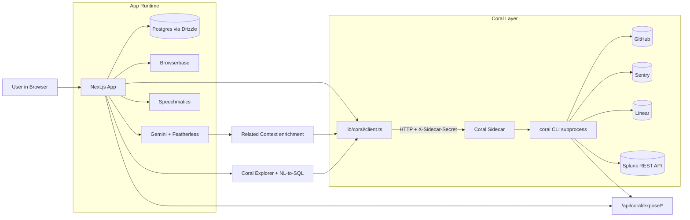

# Splunk Architecture

This is the shared-sidecar architecture used for the Splunk integration.

## Data flow

1. A test fails in Browserbase.
2. `app/api/test-cases/run/route.ts` queries Coral for GitHub, Sentry, Linear, and Splunk context.
3. Splunk log events flow through `splunk.search_results` in `coral-sources/splunk.yaml`.
4. The related context is stored on the failed test case and shown in the UI.
5. The same sidecar/catalog powers Coral Explorer and voice-driven data queries.

## AI and agent location

- Gemini handles NL-to-SQL generation and Playwright script generation.
- Featherless handles screenshot failure analysis.
- Coral is the read-only federated data layer those agent flows query.
