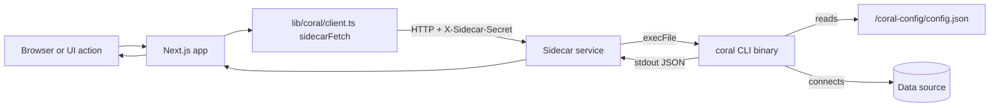

# Coral Sidecar Flow

This document explains the end to end flow between the Next.js app, the sidecar service, and the Coral CLI.

## How to run container (in EC2)

1. Make sure coral-sidecar has .env with all the required variables
2. Make sure this container image is build using: docker build -t coral-sidecar .
3. Since the image will be at global location, run the given below command from anywhere

```
docker run -d \
  --name coral-sidecar \
  -p 3000:3000 \
  -v /coral-config:/coral-config \
  --env-file .env \
  --restart unless-stopped \
  coral-sidecar
```
## High level architecture

- Next.js app calls a small HTTP client in `lib/coral/client.ts`.
- That client sends requests to the sidecar service URL (Railway, EC2, etc.).
- The sidecar service executes the external `coral` CLI binary.
- The `coral` CLI reads its config from `/coral-config` (a mounted volume).
- The sidecar returns JSON back to the Next.js app.



## What "external binary" means here

The sidecar does not run Coral logic itself. Instead it runs a separate executable (the `coral` CLI) using Node.js `execFile()`. That executable is not a Node.js dependency. It is a compiled program that must exist in the runtime image and be compatible with the OS libraries (glibc, etc.).

## Detailed request flow

1. A user action in the UI triggers a request in the Next.js app.
2. The app calls `coral.sql()`, `coral.listCatalog()`, or similar in `lib/coral/client.ts`.
3. `sidecarFetch()` sends an HTTP request to `CORAL_SIDECAR_URL` with the `X-Sidecar-Secret` header.
4. The sidecar service authenticates the header value.
5. The sidecar runs the `coral` CLI with arguments:
   - `/sql` -> `coral sql --format json <SQL>`
   - `/list-catalog` -> `coral sql --format json "SELECT ... FROM coral.tables"`
6. The `coral` CLI reads `/coral-config/config.json` to know how to connect to the data source.
7. The CLI writes results to stdout (JSON) and the sidecar parses it.
8. The sidecar returns a JSON response to the app.
9. The app returns the final response to the browser or caller.

## Why a container or VM is required

Because `coral` is a compiled executable, it needs:

- A compatible OS runtime (glibc version matters).
- The binary installed in the filesystem.
- Access to a config file in a local path (default `/coral-config`).

A Docker container or VM provides a controlled environment with:

- The required OS and libraries.
- The `coral` binary installed during image build.
- A mounted volume for `/coral-config`.

## What the volume is for

`/coral-config` is a persistent directory mounted into the sidecar container.
It usually contains `config.json`, which the `coral` CLI reads to connect to your data source.
The CLI reads the config file. It does not write query results to that directory.
Query results are returned to the app as JSON over HTTP.

## Failure modes to expect

- Missing or incompatible glibc -> `coral` fails to execute.
- Missing config or invalid config -> `coral` fails to connect.
- Wrong shared secret -> sidecar returns 401.
- Sidecar unreachable -> app reports `coral_unreachable`.

## Local testing tips

- `GET /health` checks if the `coral` binary runs.
- `GET /list-catalog` checks if the `coral` CLI can query metadata.
- If `list-catalog` fails, inspect sidecar logs for CLI stderr.
